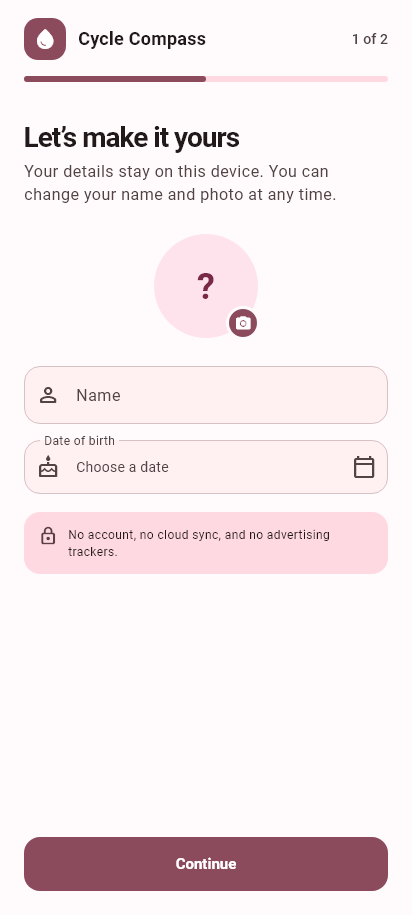
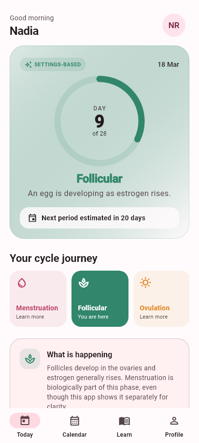
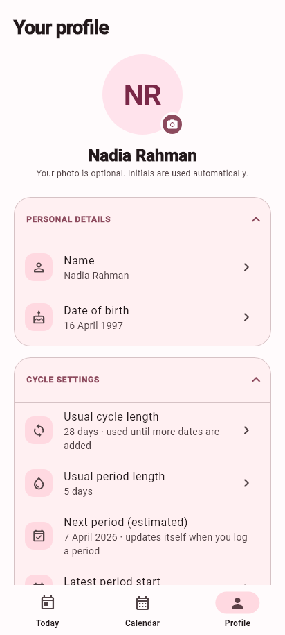

# Cycle Compass

Cycle Compass is an Android-first Flutter app that helps people understand the
four commonly described stages of the menstrual cycle. It is an educational,
offline-first MVP: cycle dates and profile details remain on the device and all
calendar predictions are clearly presented as estimates.

> Cycle Compass is not medical advice, a diagnostic tool, or a method of
> contraception. Public release content should be reviewed by a qualified
> clinician.

## MVP features

- Two-step onboarding for name, date of birth, and basic cycle information
- Optional gallery avatar with automatic first/last-name initials fallback
- Editable name, date of birth, avatar, cycle length, and period length
- Today view with cycle day, estimated phase, and next-period estimate
- Calendar view with phase colors, editable bleeding ranges, due dates, and
  data-based early/late summaries
- Day editor for recording protected or unprotected sex with distinct calendar
  icons
- Calendar legends that appear only when their phase or event is visible in
  the displayed month
- Educational content for menstruation, follicular, ovulation, and luteal stages
- Pregnancy mode with required due date and automatic postpartum transition
- Postpartum calendar coloring until the first new period is recorded
- Editable past pregnancy and postpartum ranges for historical tracking
- Editable period history with one-tap extra-day adjustments
- Default-on Android reminders for every estimated cycle phase around 9:00 AM and
  for tracking-mode changes; scheduled reminders are restored after reboot
- Local SQLite storage with Android cloud backup disabled
- Delete-all-data privacy control
- Responsive Material 3 interface with rendered phone-size preview tests

## Preview

| Onboarding | Today | Profile |
| --- | --- | --- |
|  |  |  |

## Project structure

```text
lib/
├── data/          SQLite database service
├── models/        Profile models
├── screens/       Onboarding and main app experiences
├── services/      Cycle calculation and local notification scheduling
├── widgets/       Shared avatar UI
├── app_controller.dart
└── main.dart
```

For the current architecture, runtime flows, database schema, pregnancy and
postpartum state transitions, and a file-by-file explanation of everything in
`lib/`, see [CODEBASE_EXPLANATION.md](CODEBASE_EXPLANATION.md).

## Run locally

Requirements:

- Flutter SDK compatible with Dart `^3.12.2`
- Android Studio or an Android SDK with an emulator/device configured

```bash
flutter pub get
flutter analyze
flutter test
flutter run
```

The configured app ID is `com.hikoo.cyclecompass.cycle_compass`. Release signing
must be configured before publishing to Google Play.

## Current verification

- Flutter static analysis: no issues
- Full unit, widget, and golden-preview suite: 49 tests passing
- Android debug APK: built successfully
