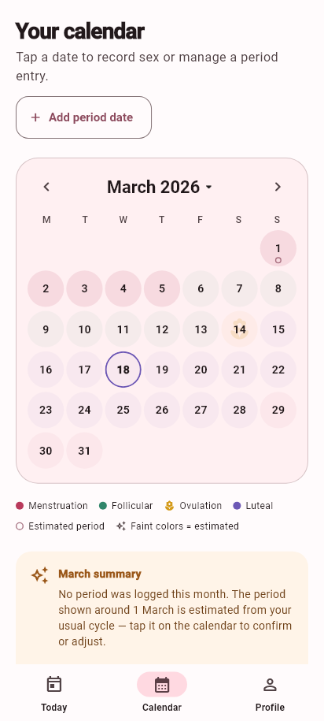
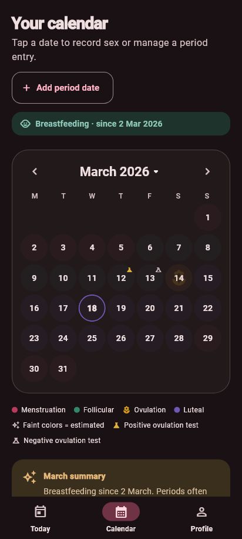

# Cycle Compass

Cycle Compass is an Android-first Flutter app that helps people understand the
four commonly described stages of the menstrual cycle. It is an educational,
offline-first MVP: cycle dates and profile details remain on the device and all
calendar predictions are clearly presented as estimates.

> Cycle Compass is not medical advice, a diagnostic tool, or a method of
> contraception. Public release content should be reviewed by a qualified
> clinician.

## MVP features

- Two-step onboarding for name, date of birth, and basic cycle information
- Optional gallery avatar with automatic first/last-name initials fallback
- Editable name, date of birth, avatar, cycle length, and period length
- Today view with cycle day, estimated phase, and next-period estimate
- Calendar view with phase colors, editable bleeding ranges, due dates, and
  data-based early/late summaries
- Estimated periods for months with no logged period: faint fills, a hollow
  start marker, a month note, and a tap action to confirm, adjust, or ignore
  each estimate
- Faint phase coloring for every day outside a cycle bounded by two recorded
  period starts, so estimates never look like recorded facts
- Day editor for recording protected or unprotected sex, and positive or
  negative ovulation tests, with distinct calendar icons
- Calendar legends that appear only when their phase or event is visible in
  the displayed month
- Educational phase content on the Today screen (the separate Learn tab is
  hidden for now; its content is retained in the codebase)
- Pregnancy mode with required due date and automatic postpartum transition
- "Baby has arrived" flow that anchors postpartum on the real birth date and
  moves the calendar's baby marker there
- Breastfeeding tracking that runs until it is ended, adds calm lactational
  amenorrhoea wording, and never hides period colors
- Postpartum calendar coloring until the first new period is recorded
- Editable past pregnancy, postpartum, and breastfeeding ranges for historical
  tracking
- Editable period history with one-tap extra-day adjustments
- Default-on Android reminders for every estimated cycle phase around 9:00 AM and
  for tracking-mode changes; scheduled reminders are restored after reboot
- Local SQLite storage with Android cloud backup disabled
- Manual backup export and restore: a single `.ccbackup` file handed to the
  Android share sheet, encrypted with a passphrase by default (AES-256-GCM,
  PBKDF2), validated fully before any restore touches existing data
- Delete-all-data privacy control
- Theme choice in settings: system, light, or dark
- Day-first European dates everywhere, including DD/MM/YYYY manual entry
- Calendar month/year scroll wheels, swipe navigation, and a baby icon on the
  expected due date until a real birth date replaces it
- Branded blood-drop splash screen and launcher icon in the app palette
- Responsive Material 3 interface with rendered phone-size preview tests

## Preview

| Onboarding | Today | Profile |
| --- | --- | --- |
|  |  |  |

| Estimated periods | Dark theme calendar |
| --- | --- |
|  |  |

## Project structure

```text
lib/
├── data/          SQLite database service
├── models/        Profile models
├── screens/       Onboarding and main app experiences
├── services/      Cycle calculation, notifications, backup, overridable clock
├── widgets/       Shared avatar UI
├── app_controller.dart
└── main.dart
```

For the current architecture, runtime flows, database schema, pregnancy and
postpartum state transitions, and a file-by-file explanation of everything in
`lib/`, see [CODEBASE_EXPLANATION.md](CODEBASE_EXPLANATION.md).

## Run locally

Requirements:

- Flutter SDK compatible with Dart `^3.12.2`
- Android Studio or an Android SDK with an emulator/device configured

```bash
flutter pub get
flutter analyze
flutter test --concurrency 2
flutter run
```

`--concurrency 2` keeps the suite inside the memory budget of a typical
development machine; the golden previews are the expensive part.

The configured app ID is `com.hikoo.cyclecompass.cycle_compass`. Release signing
must be configured before publishing to Google Play.

## Current verification

- Flutter static analysis: no issues
- Full unit, widget, and golden-preview suite: 116 tests passing
- Golden previews render with a pinned clock, so they are stable over time
- Android debug APK: built successfully
